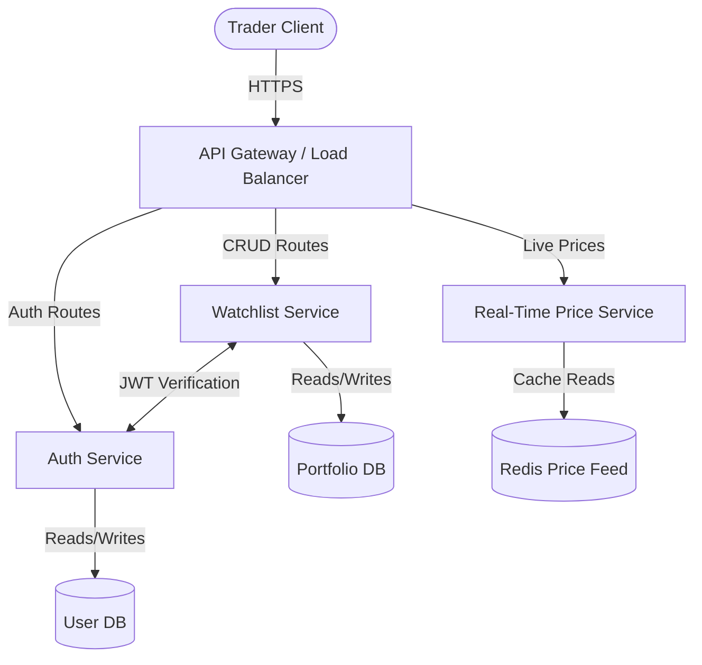

# System Scalability & Production Readiness Guide

This note outlines the architectural steps required to transition this prototype application into a high-availability, highly scalable production system capable of serving millions of active traders at **Primetrade.ai**.

---

## 1. High-Performance Caching Layer (Redis)
To reduce database load and ensure low-latency response times (sub-10ms), a distributed caching layer utilizing **Redis** is recommended:

- **Session Caching**: Store revoked JWT tokens (blacklist) for instant checking on logout, and cache authenticated session metadata.
- **Entity Caching (Watchlist reads)**:
  - Implement a **Cache-Aside** strategy. When a user requests their watchlist, the application first checks Redis (`user:watchlist:id`). On a miss, it queries the database and populates the cache with a 10-minute Time-To-Live (TTL).
  - On write operations (Create/Update/Delete), execute **Write-Through** validation: update the database first, then immediately invalidate or overwrite the Redis cache key to avoid stale reads.
- **Crypto Asset Metadata & Prices**:
  - Live price feeds (e.g., BTC, ETH prices) change constantly. Fetching these from external Web3 API nodes or aggregator scripts is expensive. Store real-time token price feeds in Redis using a brief TTL (e.g., 5 seconds) to allow rapid requests without hitting API rate limits.

---

## 2. Database Scaling & Relational Sharding
The current prototype runs on SQLite for easy local evaluation. Scaling to high write-throughput requires transitioning to an enterprise-grade database (e.g., **PostgreSQL** or **MySQL**) and applying scaling patterns:

- **Prisma Connection Pooling**: Use **PgBouncer** or **Prisma Accelerate** to pool active database connections. Express servers spawn multiple worker threads; direct connections can quickly exhaust Postgres limits under load.
- **Read-Write Splitting**:
  - Configure one **Primary (Master)** database node to receive all write transactions (user registrations, coin additions, note updates).
  - Deploy multiple **Read-Replicas** behind a load balancer. Direct all GET watchlist operations to these replicas. This dramatically increases reading throughput since read operations represent ~90% of platform traffic.
- **Horizontal Sharding**:
  - Partition the `WatchlistItem` table by `userId` (hash sharding). Since all CRUD actions on watchlist items are scoped to a specific owner, sharding by `userId` ensures queries only hit a single shard, bypassing database-wide locking bottlenecks.

---

## 3. Stateless Horizontal Scaling & Load Balancing
To accommodate surging traffic volumes, we must decouple server instances and distribute traffic:

- **Stateless Backend Nodes**: Ensure the Node.js Express server remains completely stateless (no local filesystem storage or in-memory session blocks). All persistent variables must reside in Redis or PostgreSQL.
- **Load Balancers**: Deploy an **AWS Application Load Balancer (ALB)** or **Nginx Reverse Proxy** in front of backend servers. Use round-robin or least-connections algorithms to balance incoming HTTP requests.
- **Auto-Scaling Groups**: Run Express instances inside Docker containers managed by **Kubernetes (EKS)** or **AWS ECS**. Configure Auto-Scaling rules based on CPU utilization and request count to scale up instances dynamically during high-volatility crypto market cycles.

---

## 4. Decomposing to a Microservices Architecture
As the engineering team grows, migrating the monolithic Express codebase into independent microservices will prevent deployment conflicts and allow individual service scaling:

- **Authentication Service**: Handles user register, login, credential verification, and profile management. Can scale independently based on sign-in traffic peaks.
- **Watchlist & Portfolio Service**: Specialized service to manage asset records, purchases, and strategy notes. Interacts with the sharded database cluster.
- **Real-Time Price Feed Service**: Runs WebSocket connections to external crypto exchanges (Binance, Coinbase, or decentralized chains) to stream ticker prices, maintaining a fast-running Redis memory cache for the dashboard.
- **Event-Driven Communications**: Use a message broker like **Apache Kafka** or **RabbitMQ** to handle asynchronous tasks (e.g., sending verification emails, tracking activity logs, computing platform-wide trade intelligence).

---

## 5. Security & Rate Limiting at Scale
- **IP & JWT Rate Limiting**: Shift rate limiting from the application layer to the network perimeter (e.g., **Cloudflare WAF** or **AWS WAF**) to filter malicious bots before they consume computing resources.
- **Redis Token Bucket**: For authenticated APIs, use Redis to enforce rate limits per active JWT token, preventing individual accounts from abusing endpoints.
